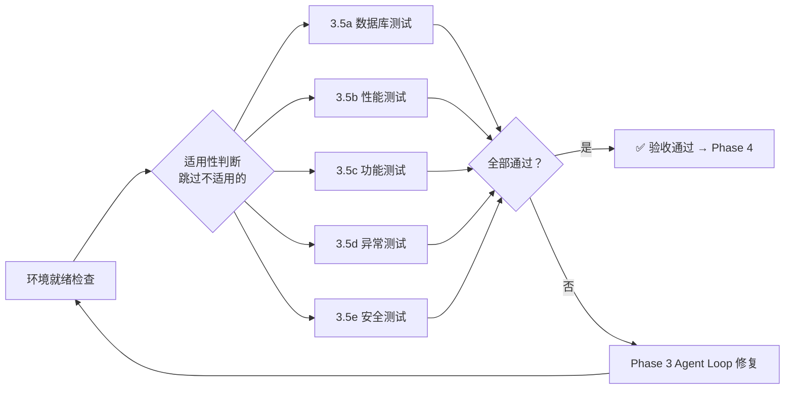

# 综合验收测试规范

本文件定义 Phase 3.5 中所有测试类型、方法、通过标准。
Codex 根据设计文档和项目配置自动判断适用性，不可跳过的类型必须执行。

## 测试顺序（按执行先后）

```
Step 3.5a: 数据库与备份    ← 先跑，确保环境干净、可回滚
    │
    ▼
Step 3.5b: 性能与压力      ← 在干净环境跑基准，不被功能测试数据干扰
    │
    ▼
Step 3.5c: 功能 E2E        ← 正常路径全链路
    │
    ▼
Step 3.5d: 异常测试        ← 在功能测试基础上模拟故障
    │
    ▼
Step 3.5e: 安全测试        ← 最后跑，可能涉及破坏性操作
```

## 0. 环境就绪检查

Phase 3.5 开始前自动检查：

| 条件 | 测试方式 | 备注 |
|------|---------|------|
| 有 staging 环境 | E2E 在 staging 跑 | 优先 staging |
| 无 staging | 本地 `npm run dev` 启动 dev server | 确保端口不冲突 |
| dev server 不可启动 | 使用 HTTP mock 做集成测试 | 只测代码逻辑 |
| 无 E2E 框架 | T1 模型生成 puppeteer 或 HTTP 脚本 | 临时方案 |

## 1. 适用性判断

每类测试执行前判断是否跳过。用户确认后执行。

| # | 测试类型 | 必须跑的条件 | 可跳过的条件 |
|---|---------|------------|------------|
| a | 数据库备份 | 本功能新增了 migration 文件 | 无 migration |
| b | 性能压力 | design.md 标记了"高流量接口"；项目已有压测工具 | 简单 CRUD + 预期用户数 < 100 |
| c | 功能测试 | **永远必须** | — |
| d | 异常测试 | 功能涉及外部依赖（DB/第三方API/文件系统） | 纯计算函数 |
| e | 安全测试 | **永远必须** | — |
| — | 兼容性 | 修改了已有 API 的请求/响应格式 | 纯新增功能 |

## 2. 数据库与备份测试（Step 3.5a）

**目的**：确保数据安全和可恢复性。

**适用条件**：本功能新增了 migration 文件 → 必须跑。无 migration → 跳过。

**方法**：

| 验证项 | 方法 | 通过标准 |
|--------|------|---------|
| 迁移可回滚 | 运行回滚命令（如 `npx prisma migrate down`、`npm run db:rollback`） | 执行成功，无错误 |
| 备份恢复 | 运行 `pg_dump` 或等效备份 → 恢复到测试库 → 查询 | 数据完整，无丢失 |
| 数据完整性 | 检查外键、唯一约束、非空约束 | 无约束违规 |

**失败处理**：
```
迁移回滚失败 → 检查迁移文件是否有破坏性操作（DROP COLUMN 等）
             → 修复后回到 Phase 2 对应 Step
备份恢复失败 → 检查备份脚本和数据库连接
```

## 3. 性能与压力测试（Step 3.5b）

**目的**：确保关键 API 在正常和压力条件下的响应时间。

**适用条件**：design.md 标记了"高流量接口"或项目已有测试数据 → 必须跑。简单 CRUD + 用户数 < 100 → 可跳过。

**方法**：

| 测试类型 | 工具/方法 | 通过标准 |
|---------|---------|---------|
| 性能基准 | `npx autocannon -c 1 -d 5 http://localhost:3000/api/xxx` | p95 ≤ 500ms |
| 压力测试 | `npx autocannon -c 50 -d 10 http://localhost:3000/api/xxx` | 错误率 ≤ 1%，p99 ≤ 2s |
| 稳定性 | 长跑 5 分钟 + 监控内存 | 无 OOM，内存增长 ≤ 20% |

**工具安装**：优先使用项目已安装的工具；无工具时用 autocannon（Node 项目）。

**失败处理**：
```
性能不达标 → 检查 N+1 查询 / 无索引 / 重复计算 / 未缓存
压力测试失败 → 检查连接泄漏 / 死锁 / 未关闭 cursor
修复后回到 Phase 2 对应 Step
```

## 4. 业务流程功能测试（Step 3.5c）

**目的**：验证整个业务链路从入口到出口按预期工作。

**适用条件**：永远必须。

**方法**：
- 对 acceptance.md 中所有 ✅ Done 的场景运行 E2E
- 按"对应 Step"列的顺序逐场景验证
- 使用项目现有 E2E 框架（Playwright / Cypress / Vitest + supertest）
- 无 E2E 框架时：T1 模型生成基于 HTTP 请求的集成测试

**通过标准**：每个场景的预期输出与实际输出一致。

**失败处理**：
```
E2E 失败 → 检查是回归还是新问题
  回归（之前 Step 的测试通过但现在不通过）→ Phase 3 Agent Loop
  新问题（场景本身有误）→ 更新 acceptance.md 描述后重新判断
```

## 5. 异常测试（Step 3.5d）

**目的**：验证系统在异常输入和外部依赖故障时的表现。

**适用条件**：功能涉及外部依赖（DB/第三方API/文件系统）→ 必须跑。纯计算函数 → 可跳过。

**用例**：

| 异常场景 | 验证方式 | 预期行为 |
|---------|---------|---------|
| 输入非法参数 | 传入空值/越界值/错误格式 | 返回 4xx，不 crash，不暴露 stack trace |
| 数据库断开 | 停止 postgres 后请求 | 返回 503，错误信息不含内部细节 |
| 第三方 API 超时 | mock 外部服务延迟 5s | 返回 504，超时时间 ≤ 30s |
| 并发请求 | 同时发送相同请求 N 次 | 无数据竞争、无重复提交 |
| 文件格式错误 | 上传损坏的文件 | 返回友好错误，不 crash |

**通过标准**：所有异常场景不导致 500 / crash / 数据损坏。

**失败处理**：修复后回到 Phase 2 对应 Step。

## 6. 安全测试（Step 3.5e）

**目的**：发现依赖漏洞和代码级安全问题。

**适用条件**：永远必须。

**方法**：

| 检测项 | 命令/方法 | 说明 |
|--------|---------|------|
| 依赖漏洞 | `npm audit`（Node）/ `pip audit`（Python） | 检测已知 CVE |
| 越权漏洞 | AI 扫描路由 handler 中的权限校验 | 用户 A 能否访问用户 B 的数据 |
| 注入漏洞 | AI 扫描 SQL 拼接 / eval / shell 命令 | 是否使用参数化查询 |
| 敏感信息 | AI 扫描硬编码密钥 / Token / 密码 | 是否引用 .env |
| XSS/CSRF | AI 扫描未转义用户输入 / 无 CSRF Token | React 的 `dangerouslySetInnerHTML` |

**通过标准**：
- 无 Critical / High 级别的依赖漏洞
- AI 代码扫描无安全违规标记

**失败处理**：
```
依赖漏洞 → npm audit fix / pip audit fix
代码安全问题 → 修复后回到 Phase 2 对应 Step
```

## 7. 整体验收标准


